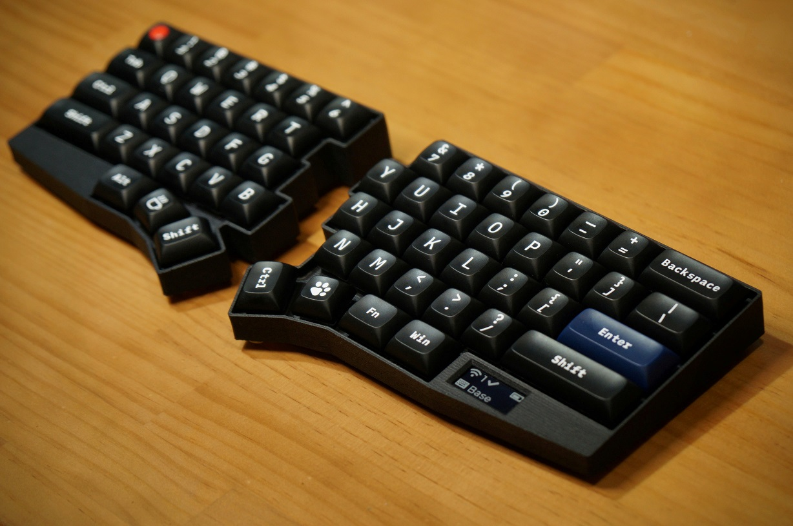
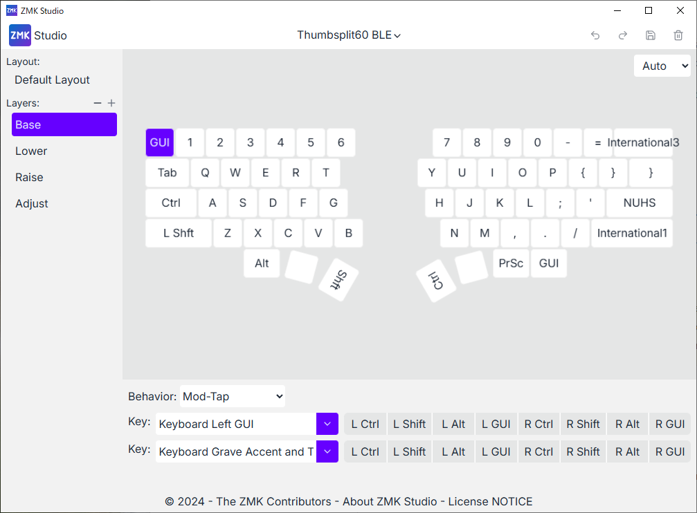

# Thumbsplit60 BLE

Custom designed battery powered fully wireless split keyboard with a display on the right half running ZMK firmware.



Thumbsplit60 BLE firmware includes a custom widget to display peripheral (left half) battery and connection status on the central (right half). This icon also indicates peripheral connection status: cross for not connected, and displaying battery status for connected.

Default firmware configuratin enables output, battery, and layer status. Please refer [ZMK dislay configuration page](https://zmk.dev/docs/config/displays) about ZMK's predefined widgets.

## Prebuilt Firmware Binaries

You can just download the pre-built firmware binaries to flash here:
- [thumbsplit60ble_left](bin/thumbsplit60ble_left-zmk.uf2)
- [thumbsplit60ble_right](bin/nice_view-thumbsplit60ble_right-zmk.uf2)

Plug your keyboard to the PC with USB and double-click the reset button next to the USB connecter to enter the bootloader. Drag and drop the firmware `uf2` file to the USB flash directory. After finishng file copy, the keyboard will reset automatically with the new firmware.

> [!NOTE]
> You have to write left and right firmware separetely to each corresponding half.

## Cutomize Keymap

Thumbsplit 60 BLE firmware Supports [ZMK Studio](https://zmk.dev/docs/features/studio). You can connect the keyboard via USB for [web version](https://zmk.dev/docs/features/studio) and USB and Bluetooth for [desktop version](https://zmk.studio/download). Please press `S` in adjust (pressing ralse and lower key) layer to unlock studio when `Unlock To Continue` message pops out on ZMK Studio.

> [!TIP]
> We recommend to connect via Bluetooth using desktop version as current version's USB connection unstable, and it cannot receverred even if reseting the keyboard. Connection via Bluetooth seems to be more stable and errors will be resolved after resetting the keyboard.



Current default keymap has three layers (lower, raise, and adjust). Lower and raise layers are mostnly consists of just F1 ~ F12 keys, and adjust layers is mostly for device configuration. Some important keymaps are listed in the following table. 

| Adjust Layer Key Map | Description |
| --- | --- |
| Esc       | Turn off device (need to press reset to wake up) |
| Backspace | Clear current BT# connection info and start pairing |
| 1-5       | Selecting BT1 ~ BT5 |
| U         | Enable USB output |
| B         | Enable Bluetooth output|
| S         | Studio unlock  |

## Building Firwmare

If you want to build the firmware with your customization like advanced keymap changes that ZMK Studio does not support, using GitHub workflow is the easiest way.

Log in to your GitHub account and fork this repository. Then the firmware will be automatically build on GitHub workflow pipeline, and you can download the artifact `firmware.zip` from Actions tab of the repository.

### Local Build Steps

If you wish to build the firmware on your local environment rather than using GitHub workflow, you may want to use ZMK docker container environment.

First, clone ZMK repository.
```
git clone https://github.com/zmkfirmware/zmk.git
cd zmk
```

Note current version of this repository is confirmed with ZMk commit of Dec 20, 2024. If your build goes wrong with the latest commit of the ZMK repository, please try to checkout this commit.
```
git checkout 3f6841c95ff9a82658576828895ebcba1b0a5f86
```

Then, clone this repository inside the repository as `zmk-config`.
```
git clone https://github.com/mohammedari/thumbsplit60ble-zmk-config zmk-config
```

Open the directory using VSCode with [Remote - Containers extension](https://marketplace.visualstudio.com/items?itemName=ms-vscode-remote.remote-containers) enabled. Then VSCode handles all necessary initial setup procedures automatically by just click `Reopen in Container`.

Then, you can type following commands in `app` directory to build firmware in the VSCode container terminal.
```
cd app
west build -p -b thumbsplit60ble_left  -d build/left  -- -DZMK_EXTRA_MODULES=/workspaces/zmk/zmk-config -DZMK_CONFIG=/workspaces/zmk/zmk-config/config
west build -p -b thumbsplit60ble_right -d build/right -- -DZMK_EXTRA_MODULES=/workspaces/zmk/zmk-config -DZMK_CONFIG=/workspaces/zmk/zmk-config/config -DSHIELD=nice_view
```
The firmware will be generated as `app/build/{left,right}/zephyr/zmk.uf2` file.
Please refer more detailed instruction on the [official document](https://zmk.dev/docs/development/local-toolchain/setup/container) for more information.

### Note on ZMK Studio Support on Local Build

If you want to build a firmware with supporting ZMK Studio, you can build central (right) half with the additional parameters below.
```
west build -p -b thumbsplit60ble_right -S studio-rpc-usb-uart -d build/right -- -DZMK_EXTRA_MODULES=/workspaces/zmk/zmk-config -DZMK_CONFIG=/workspaces/zmk/zmk-config/config -DCONFIG_ZMK_STUDIO=y -DSHIELD=nice_view
```

However, current version ZMK will cause following error on Windows environment. You have to prepare another environment other than Windows to build with ZMK support.
```
[42/558] Generating nanopb/generator/proto/nanopb_pb2.py
FAILED: nanopb/generator/proto/nanopb_pb2.py /workspaces/zmk2/app/build/right/nanopb/generator/proto/nanopb_pb2.py 
cd /workspaces/zmk2/app/build/right && /workspaces/zmk2/modules/lib/nanopb/generator/protoc -I/workspaces/zmk2/app/build/right/nanopb/generator/proto --python_out=/workspaces/zmk2/app/build/right/nanopb/generator/proto /workspaces/zmk2/app/build/right/nanopb/generator/proto/nanopb.proto
/usr/bin/env: 'python3\r': No such file or directory
/usr/bin/env: use -[v]S to pass options in shebang lines
[59/558] Building C object zephyr/CMakeFiles/zephyr.dir/subsys/usb/device/usb_device.c.obj
ninja: build stopped: subcommand failed.
FATAL ERROR: command exited with status 1: /usr/local/bin/cmake --build /workspaces/zmk2/app/build/right
```
